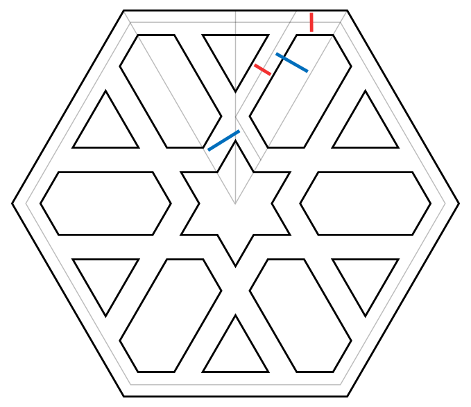

# hexaStar
processing3-script that generates a pattern of star-like shapes with a hexagonal outline. Two randomized parameters control the appearance of each shape.

*Visualization of the basic idea and parameters of a single shape (line width - red, line distance - blue)*

